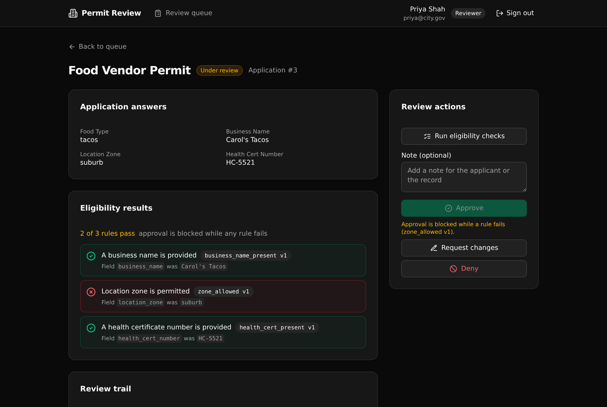

# Permit Review Workflow

**The governed backend under a public permit intake tool, built in Xano with TypeScript.**

Residents apply for a permit through a fast-built frontend, and staff review it. The rules that keep the program safe (completeness, eligibility, and who is allowed to decide) live in one versioned API layer, not in the UI. An AI-generated frontend can be rebuilt any time and it still cannot skip a required check or let the wrong person approve a permit, because those rules are enforced in the endpoints.

> Play: **Pilot to Production**. Vertical: **Government**. The one governed job: make an AI-built intake tool production safe with API-layer RBAC and versioned rules.



## What it demonstrates

A government platform director can point a technical evaluator at this backend and say "the rules are right here, and you can read them." That is the whole idea: speed is not the differentiator, control is.

- **Completeness is checked at the API.** The submit endpoint reads the permit type's required fields and refuses an incomplete submission, naming the missing fields. The frontend cannot bypass it.
- **Eligibility rules are versioned.** Each rule carries a version, and a retired rule stays in the table with `active: false`. A reviewer always sees which version of a rule fired on a past decision.
- **One engine gates the decision.** The same `evaluate_application` function that shows a reviewer the per-rule results is the code that blocks an approval while any active rule fails. The rule set is defined once.
- **RBAC lives in the API layer.** Roles are read inside each endpoint and checked with a precondition. An applicant who forces the review queue or a decision call gets a 403, not just a hidden button. There is no row-level security here; access is enforced at the endpoint.
- **Every step is audited.** The `review_actions` table is append-only. Submit, run checks, request changes, approve, and deny are all recorded with who did it and when.

**5 tables · 12 APIs · 1 shared function.**

## Repo layout

```
xano/
  index.ts                 the workspace, registering everything
  tables/                  users, permit_types, eligibility_rules,
                           permit_applications, review_actions
  functions/evaluate.ts    the one eligibility engine (shared)
  api/                     auth, catalog, applications, review, seed
  xano.lock                pinned object identities (committed)
frontend/                  React + Vite + Tailwind + shadcn/ui
  src/lib/api.ts           the one contract: paths + types from the defs
  src/screens/             login, apply, my applications, queue, detail
```

## API surface

| Method | Path | What it enforces |
| --- | --- | --- |
| POST | `/api:permit_auth/signup` | Self-serve registration. Role is forced to `applicant`. |
| POST | `/api:permit_auth/login` | Verify credentials, mint a token. |
| GET | `/api:permit_auth/me` | The current user and role. |
| GET | `/api:permit_catalog/permit-types` | Active permit types and their required fields. |
| POST | `/api:permit_apps/save` | Create or update a draft. Own-record and active-type guards. |
| POST | `/api:permit_apps/submit` | Completeness check. Blocks and names the missing fields. |
| GET | `/api:permit_apps/mine` | The caller's own applications. |
| GET | `/api:permit_apps/get/{application_id}` | One application with rules and the full trail. Applicant sees only their own. |
| POST | `/api:permit_review/run-checks` | Reviewer or admin. Evaluate active rules, record per-rule results, move to under review. |
| POST | `/api:permit_review/decide` | Reviewer or admin. Approve is refused while any active rule fails. |
| GET | `/api:permit_review/queue` | Reviewer or admin. Applications by status. |
| POST | `/api:permit_seed/run` | Idempotent demo seed. |

## Quick start

You need a free Xano account. From a clone, this goes to a live backend in about a minute.

```bash
git clone https://github.com/xano-scratch/permit-review-workflow.git
cd permit-review-workflow
npm install
npx xanots login          # one-time browser auth with your Xano account
npm run xano:deploy       # builds the frontend, deploys the backend, prints the live URL
```

The deploy ships the backend and the static frontend to one disposable environment and prints the URL. Then load the demo data (from the sign-in screen's "Load demo data" button, or POST `/api:permit_seed/run`) and sign in with any seeded account. Every seeded password is `password123`.

Seeded accounts:

- `priya@city.gov` (reviewer)
- `admin@city.gov` (program admin)
- `alice@example.com` (applicant)

## Try the governed behavior

1. Sign in as `alice@example.com`, start a Block Party application, leave a required field blank, and submit. The API names the missing fields and the draft does not move.
2. Sign in as `priya@city.gov`, open the Food Vendor application in the queue, and run the checks. The location zone rule fails, and Approve is blocked.
3. Still as the reviewer, try to approve it anyway (the API returns a 400 that names the failing rule and its version). Then request changes or deny it, and watch the audit trail grow.
4. Sign back in as the applicant and try to open the review queue. The API returns a 403, because the role check lives in the endpoint.

## How the rule engine works

`eligibility_rules` holds one row per check, with a `check_type` (`field_present`, `min`, `max`, `equals`, `in_set`), the `field` it tests in the application's `form_data`, and a `config` (a threshold or an allowed set). The shared `evaluate_application` function loads the active rules for the application's permit type and applies each one, returning the per-rule pass or fail with the rule key and version. Both the reviewer's "run checks" action and the approve gate call the same function, so what a reviewer reads is exactly what governs the decision.

## Notes on Xano

- Authentication and authorization are enforced at the API layer with role checks in each endpoint. This is not row-level security.
- The backend is authored in TypeScript with the xanots SDK and compiled to Xano's import format. XanoScript is a way to read and write that logic, not a separate compiled output.
- Everything runs on seed data. No external services or credentials are required.

## License

MIT. See [LICENSE](LICENSE).
